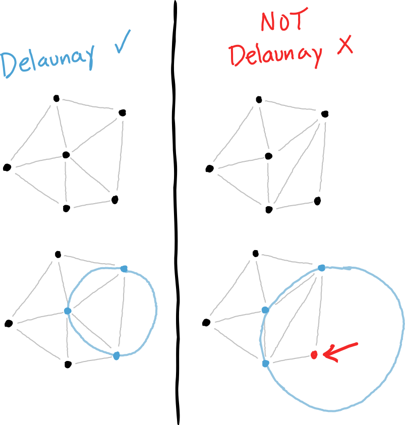

# Weighted Voronoi Stippling
This sketch is based on the following tutorial [youtube.com - Coding Challenge 181: Weighted Voronoi Stippling](https://www.youtube.com/watch?v=Bxdt6T_1qgc&ab_channel=TheCodingTrain)

## What is delaunay triangulation?
With the delaunay triangulation, we are connecting a set of points with triangles. The triangles are drawn in a way, that when the points of the triangle lie on a circle, no other point is inside the circle.

## What is a voronoi?
A voronoi is the center of the circle that is drawn when doing the delaunay triangulation.

## Relaxing a voronoi

## Using d3 to help

## Sweep algorithm