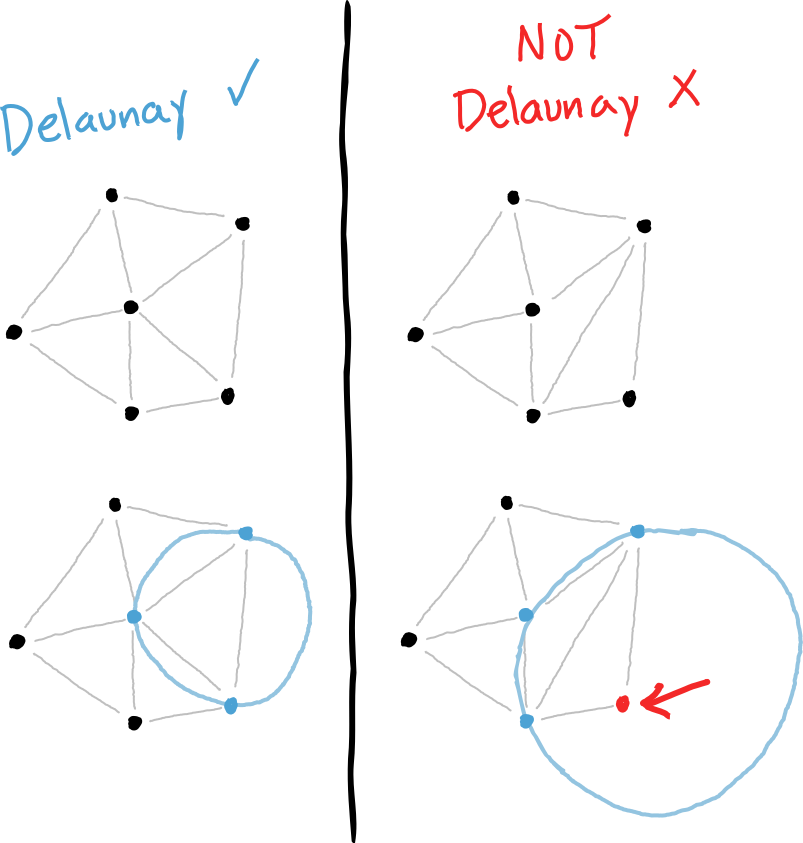

# Weighted Voronoi Stippling
This sketch is based on the following tutorial [youtube.com - Coding Challenge 181: Weighted Voronoi Stippling](https://www.youtube.com/watch?v=Bxdt6T_1qgc&ab_channel=TheCodingTrain)

## What is delaunay triangulation?
With the delaunay triangulation, we are connecting a set of points with triangles. The triangles are drawn in a way, that when the points of the triangle lie on a circle, no other point is inside the circle.

## What is a voronoi diagram?
A voronoi diagram is a set of polygons. These polygons are defined by the set of points. The area of the polygons is defined by the space that is closest to the point. The edges of the voronoi diagram are the center of the circle that is drawn when doing the delaunay triangulation.

## Relaxing a voronoi

## Using d3 to help

## Sweep algorithm

## Lloyds algorithm